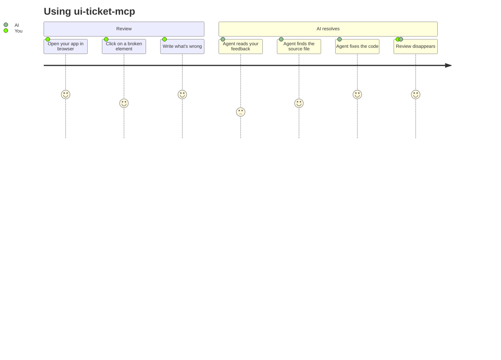
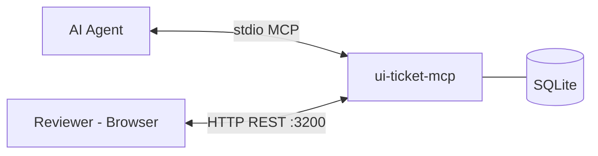
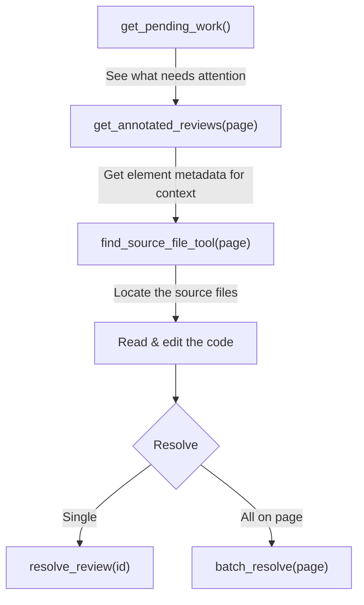

# ui-ticket-mcp

**Human-to-AI code review bridge.** Review UI prototypes directly in the browser, then let AI agents read your feedback and fix the code automatically.

You click on elements, write review comments like "This button should be blue" or "The spacing is wrong here", and your AI coding agent (Claude Code, Codex, Cursor, etc.) picks them up via MCP and resolves them - with full context about which element you pointed at, its CSS, position, and surrounding DOM.

## How it works



One Python process handles everything - MCP protocol for the agent (stdio) and REST API for the browser UI (HTTP). Reviews are stored in a SQLite database inside your project.

---

## Quick Start

### 1. Connect to your AI agent

Add to your project's `.mcp.json` (Claude Code, Codex, Cursor, etc.):

```json
{
  "mcpServers": {
    "ui-ticket-mcp": {
      "command": "uvx",
      "args": ["ui-ticket-mcp"],
      "env": {
        "PROJECT_ROOT": "/path/to/your/project",
        "REVIEW_PORT": "3200"
      }
    }
  }
}
```

Restart the agent. `uvx` downloads and runs the package automatically - no manual install needed.

> **Alternative:** `pip install ui-ticket-mcp`, then use `"command": "ui-ticket-mcp"` instead of `uvx`.

When the MCP server starts, it also launches a REST API on `http://localhost:3200` (or your custom `REVIEW_PORT`) for the browser UI.

> **Important:** The API always runs **locally** (`localhost`). The website `https://uiticket.0ics.ai/` is the landing page only — it is NOT an API endpoint. Always use `http://localhost:{PORT}/api` as the `api-url`.

### 2. Add the browser UI to your app

```bash
npm install ui-ticket-panel
```

```html
<script type="module">
  import { defineReviewPanel } from 'ui-ticket-panel';
  defineReviewPanel();
</script>

<review-panel api-url="http://localhost:3200/api"></review-panel>
```

That's it. Works in **any framework** - Angular, React, Vue, Svelte, or plain HTML. It's a standard Web Component.

#### No bundler? Use CDN

```html
<script type="module" src="https://unpkg.com/ui-ticket-panel/dist/bundle.js"></script>
<review-panel api-url="http://localhost:3200/api"></review-panel>
```

The bundle auto-registers the `<review-panel>` element. No npm install, no build step needed.

### 3. Start reviewing

Open your app in the browser. You'll see a floating chat button in the bottom-right corner. Click it to open the review panel, or press **Alt+A** to enter annotation mode and click directly on elements.

---

## Browser UI Features

### Review Panel

The floating panel lets you browse, filter, and manage all reviews:

- **Filter tabs** - Switch between Open, Resolved, and All reviews
- **Search** - Full-text search across all review comments
- **Tag filter** - Filter by category: general, bug, suggestion, question
- **Per-review actions** - Resolve, Reopen, Delete, Reply, Highlight element
- **Threaded replies** - Reply to reviews for back-and-forth discussion
- **Manual review form** - Write reviews without annotation (Ctrl+Enter to submit)
- **Badge counter** - Floating button shows count of open reviews

### Annotation System

The annotation system lets you point at specific elements and attach reviews to them:

- **Click-to-annotate** - Press Alt+A (or the target button), then click any element
- **Multi-select drag** - Click and drag to select a region of multiple elements
- **Hover preview** - See element identification in real-time as you move the mouse
- **Smart popup** - Appears above or below the element depending on available space

When you annotate an element, the system captures rich metadata that helps the AI agent understand exactly what you're pointing at:

| Captured data | Example |
|---------------|---------|
| Element name | `Button 'Save'`, `Input[email] 'Your email'`, `Heading 2 'Features'` |
| CSS selector | `#main-header`, `div.card > button.primary:nth-of-type(2)` |
| Bounding box | Position and dimensions in pixels |
| Nearby text | Own text + previous/next sibling text for context |
| Selected text | If you highlight text before annotating |
| CSS classes | Filtered (excludes framework-generated hashes) |
| Computed styles | Color, background, font, border, padding (smart per element type) |
| Full DOM path | `body > div#app > section.content > div.card > button` |
| Accessibility | ARIA roles, labels, tabindex, focusability |
| Sibling context | Parent tag, children count, adjacent sibling tags |

### Marker Badges

Reviews with annotations show numbered badges on the page next to the annotated element:

- **Single review** - Circular badge with the review ID, colored red (open) or green (resolved)
- **Stacked reviews** (3+ on the same element) - Pill badge showing count, with a gradient showing open/resolved ratio
- **Click badge** - Opens the review in the panel
- **Delete badge** - Remove via the X button on hover
- **Tooltip** - Hover to see author, element name, and comment preview

### Tags

Every review can be tagged with a category:

| Tag | Color | Use for |
|-----|-------|---------|
| `general` | Indigo | General feedback (default) |
| `bug` | Red | Something is broken |
| `suggestion` | Green | Improvement idea |
| `question` | Amber | Needs clarification |

### Keyboard Shortcuts

| Shortcut | Action |
|----------|--------|
| **Alt+A** | Toggle annotation mode |
| **Ctrl+Enter** | Submit review or reply |
| **Escape** | Close popup / exit annotation mode |

---

## Architecture



- **MCP** (stdio) - Your agent framework starts it automatically. 10 tools for AI agents to read, resolve, and manage reviews.
- **REST API** (HTTP :3200) - Starts in background, serves the browser review UI. CORS enabled for all origins.
- **SQLite** (WAL mode) - Concurrent readers + 1 writer, 5s busy timeout. Database lives inside your project at `.reviews/reviews.db`.

---

## MCP Tools

10 tools available to AI agents:

### `get_review_summary()`

Overview of all pages with review counts.

```
Page         | Open | Resolved | Total
------------ | ---- | -------- | -----
user-profile |    3 |        1 |     4
dashboard    |    0 |        2 |     2
```

### `get_reviews(page_id?: str)`

List review comments. Optionally filtered by page. Shows status, tag, element context, and reply chains.

```
[#1] [OPEN] [bug] user-profile - alice: The header spacing is off
  → Element: Heading 2 'User Profile' | Selector: h2.page-title
[#2] [RESOLVED] user-profile - bob: Button color should be blue
```

### `get_annotated_reviews(page_id?: str)`

Returns only reviews that have element annotation metadata. Includes element name, CSS selector, full DOM path, selected text, accessibility info - everything the agent needs to locate and understand the annotated element.

### `get_pending_work()`

All open reviews grouped by page - the agent's "todo list".

```
## user-profile (2 open)
  - #1 [bug] (alice): The header spacing is off
  - #3 [suggestion] (alice): Add hover state to buttons

## dashboard (1 open)
  - #4 (bob): Chart labels are truncated
```

### `add_review(page_id, author, text, tag?, metadata?, parent_id?)`

Create a new review. Supports tags, annotation metadata (JSON), and threading via `parent_id`.

### `resolve_review(review_id, resolved_by?)`

Mark a review as resolved. Sets `resolved_at` timestamp and `resolved_by` (defaults to `"agent"`).

### `reopen_review(review_id)`

Reopen a previously resolved review. Clears resolution info.

### `batch_resolve(page_id, resolved_by?)`

Resolve all open reviews on a page at once. Returns `Resolved 3 review(s) on user-profile.`

### `find_source_file_tool(page_id)`

Find source files in `PROJECT_ROOT` matching a page ID. Searches by kebab-case, CamelCase, and glob patterns. Skips `node_modules`, `dist`, `.git`.

```
Found 3 file(s) for 'user-profile':
  - src/app/user-profile/user-profile.component.ts
  - src/app/user-profile/user-profile.component.html
  - src/app/shared/UserProfile.ts
```

### `get_setup_guide()`

Returns the full setup guide (MCP config, REST API, browser UI). Useful when the agent needs to help set up the review system in a new project.

### Typical agent workflow



---

## REST API

All endpoints under `/api`. CORS enabled for all origins.

### Reviews

| Method | Endpoint | Description |
|--------|----------|-------------|
| GET | `/api/reviews/summary` | Per-page summary with open/resolved counts |
| GET | `/api/reviews` | All reviews (newest first) |
| GET | `/api/reviews/{page_id}` | Reviews for a page. Query: `?status=open\|resolved`, `?tag=bug\|suggestion\|...` |
| POST | `/api/reviews/{page_id}` | Create review |
| PATCH | `/api/review/{id}` | Update review (status, text, tag, metadata) |
| DELETE | `/api/review/{id}` | Delete review permanently |

### Replies

| Method | Endpoint | Description |
|--------|----------|-------------|
| GET | `/api/review/{id}/replies` | Get all replies to a review (chronological) |
| POST | `/api/reviews/{page_id}` | Create reply (include `parent_id` in body) |

### POST body

| Field | Type | Default | Description |
|-------|------|---------|-------------|
| `text` | string | - | Review comment (required) |
| `author` | string | `"anonymous"` | Reviewer name |
| `tag` | string | `"general"` | `"general"`, `"bug"`, `"suggestion"`, or `"question"` |
| `metadata` | object | - | Annotation context (element, selector, styles, etc.) |
| `parent_id` | integer | - | Parent review ID for threaded replies |

### PATCH body

| Field | Type | Description |
|-------|------|-------------|
| `status` | `"open"` \| `"resolved"` | Resolving auto-sets `resolved_at` and `resolved_by` |
| `text` | string | Updated comment text |
| `tag` | string | Updated tag |
| `resolved_by` | string | Who resolved it (default: `"user"` via API, `"agent"` via MCP) |
| `metadata` | object | Updated annotation metadata |

---

## Database

Reviews are stored in SQLite inside your project at `{PROJECT_ROOT}/.reviews/reviews.db`. The database is auto-created on first run.

The `.reviews/` directory includes:

| File | Purpose |
|------|---------|
| `reviews.db` | SQLite database (commit to git to share reviews with your team) |
| `.gitkeep` | Ensures directory is tracked |
| `.gitignore` | Ignores WAL temp files (`*.db-wal`, `*.db-shm`) |

**Path resolution:**

1. `REVIEW_DB_PATH` env var (explicit override)
2. `PROJECT_ROOT/.reviews/reviews.db` (default)
3. `./reviews.db` (fallback)

### Schema

```sql
reviews (
  id          INTEGER PRIMARY KEY,
  page_id     TEXT NOT NULL,
  author      TEXT DEFAULT 'anonymous',
  text        TEXT NOT NULL,
  status      TEXT DEFAULT 'open',       -- 'open' | 'resolved'
  created_at  TEXT NOT NULL,             -- ISO 8601
  resolved_at TEXT,
  resolved_by TEXT,
  metadata    TEXT,                       -- JSON: annotation context
  tag         TEXT DEFAULT 'general',    -- 'general' | 'bug' | 'suggestion' | 'question'
  parent_id   INTEGER REFERENCES reviews(id)  -- threaded replies
)
```

### Annotation metadata (JSON)

When a review is created via annotation, the `metadata` field contains:

```json
{
  "element": "Button 'Save'",
  "selector": "button.btn-primary",
  "boundingBox": { "x": 100, "y": 200, "width": 80, "height": 40 },
  "selectedText": "Click to save",
  "cssClasses": "btn btn-primary active",
  "nearbyText": "Save your work | [after:] Cancel",
  "nearbyElements": "Parent: form.editor (5 children) | Siblings: input, button.secondary",
  "computedStyles": "color: #fff, background: #3b82f6, border-radius: 4px",
  "fullPath": "body > div#app > div.modal > form > button",
  "accessibility": "role=\"button\", tabindex=\"0\", focusable",
  "isMultiSelect": false,
  "url": "http://localhost:4200/user-profile"
}
```

This metadata gives the AI agent precise context about what you annotated - which element, where it is, what it looks like, and how to find it in the DOM.

---

## Web Component Attributes

| Attribute | Default | Description |
|-----------|---------|-------------|
| `api-url` | `/api` | REST API base URL (e.g. `http://localhost:3200/api`) |
| `page-id` | (auto from URL) | Page identifier for filtering reviews |

### Programmatic API

```typescript
const panel = document.querySelector('review-panel');

// Change page without reloading
panel.setPageId('dashboard');
```

---

## Packages

| Package | Registry | Description |
|---------|----------|-------------|
| [`ui-ticket-mcp`](https://pypi.org/project/ui-ticket-mcp/) | PyPI | Python MCP server + REST API |
| [`ui-ticket-panel`](https://www.npmjs.com/package/ui-ticket-panel) | npm | `<review-panel>` Web Component |
| [`ui-ticket-core`](https://www.npmjs.com/package/ui-ticket-core) | npm | Framework-agnostic core: types, API client, reactive store, annotation engine |

---

## Environment Variables

| Variable | Default | Description |
|----------|---------|-------------|
| `PROJECT_ROOT` | - | Root of the reviewed project. DB auto-created at `{PROJECT_ROOT}/.reviews/` |
| `REVIEW_DB_PATH` | (auto) | Explicit DB path override. Takes priority over `PROJECT_ROOT` |
| `REVIEW_PORT` | `3200` | Port for the REST API server |

---

## Framework Examples

### Plain HTML (with bundler)

```html
<script type="module">
  import { defineReviewPanel } from 'ui-ticket-panel';
  defineReviewPanel();
</script>
<review-panel api-url="http://localhost:3200/api"></review-panel>
```

### Plain HTML (no bundler / CDN)

```html
<script type="module" src="https://unpkg.com/ui-ticket-panel/dist/bundle.js"></script>
<review-panel api-url="http://localhost:3200/api"></review-panel>
```

### React

```tsx
import { defineReviewPanel } from 'ui-ticket-panel';
defineReviewPanel();

function App() {
  return <review-panel api-url="http://localhost:3200/api" />;
}
```

### Vue

```vue
<template>
  <review-panel api-url="http://localhost:3200/api"></review-panel>
</template>

<script setup>
import { defineReviewPanel } from 'ui-ticket-panel';
defineReviewPanel();
</script>
```

### Angular

```typescript
// app.config.ts
import { defineReviewPanel } from 'ui-ticket-panel';
defineReviewPanel();

// component - add CUSTOM_ELEMENTS_SCHEMA
@Component({
  schemas: [CUSTOM_ELEMENTS_SCHEMA],
  template: `<review-panel api-url="http://localhost:3200/api"></review-panel>`
})
```

### Svelte

```svelte
<script>
  import { defineReviewPanel } from 'ui-ticket-panel';
  defineReviewPanel();
</script>

<review-panel api-url="http://localhost:3200/api"></review-panel>
```

---

## Issues & Feedback

Found a bug or have a feature request? [Open an issue](https://github.com/0ics-srls/ui-ticket-mcp_public/issues) on this repository.

---

## License

CC BY-NC 4.0 — free for study, research, and non-commercial use. See [LICENSE](LICENSE) for details.

---

Built by **Šimon Cmar**, **Ladislav Sopko** & **Lorenzo Leoni**
